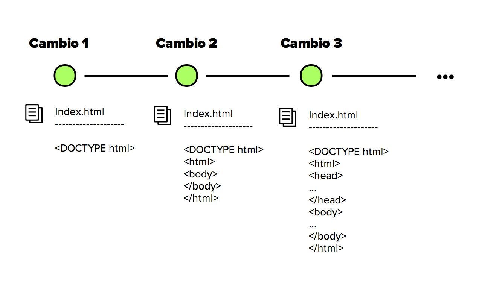

# Resumen sobre Control de Versiones

## ¿Qué es el Control de Versiones?

El **control de versiones (VCS, por sus siglas en inglés)** es un sistema que registra los cambios que se realizan en uno o varios archivos a lo largo del tiempo.  
Gracias a este sistema es posible:

- Recuperar versiones anteriores de un archivo o de todo un proyecto.
- Comparar modificaciones realizadas a lo largo del tiempo.
- Identificar quién hizo un cambio, cuándo y por qué.
- Localizar fácilmente errores introducidos en una versión específica.
- Restaurar archivos en caso de pérdida o daño.

En otras palabras, un VCS permite trabajar con mayor seguridad y organización, ya que los cambios quedan documentados y es posible revertir cualquier error.

---

## Tipos de Sistemas de Control de Versiones

A lo largo del tiempo se han desarrollado diferentes enfoques de control de versiones:

### 1. Sistemas de Control de Versiones Locales

Los **VCS locales** son los más básicos.  
- Consisten en una **base de datos simple** que almacena los cambios realizados en los archivos dentro de la misma computadora.  
- El inconveniente es que si el disco duro falla o el usuario pierde los archivos, también se pierde el historial completo.  

---

### 2. Sistemas de Control de Versiones Centralizados

Los **VCS centralizados (CVCS)** dieron un gran paso en la colaboración.  
- Se utiliza un **servidor central** donde se guardan todos los archivos versionados.  
- Los colaboradores se conectan a ese servidor para descargar y subir los cambios.  
- Permiten mayor control por parte de los administradores, pero presentan un riesgo: si el servidor falla, todo el historial puede perderse.

---

### 3. Sistemas de Control de Versiones Distribuidos

Los **VCS distribuidos (DVCS)** son los más modernos y seguros.  
- Cada colaborador descarga no solo la última versión de los archivos, sino una **copia completa del repositorio** con todo su historial.  
- Esto permite trabajar sin conexión a internet y tener un respaldo completo en cada máquina.  
- Si el servidor falla, cualquier copia local puede restaurar el proyecto.  

---

## Conclusión

El **control de versiones** es una herramienta fundamental para cualquier proyecto de software (y cada vez más usada en otras áreas como la documentación o diseño).  
Su evolución ha pasado de sistemas simples y locales a centralizados, y finalmente a los **distribuidos**, que ofrecen mayor seguridad, flexibilidad y facilidad para la colaboración en equipos.  

Hoy en día, herramientas como **Git y plataformas como GitHub o GitLab** se han convertido en estándares para la gestión de proyectos y el trabajo colaborativo.

---

